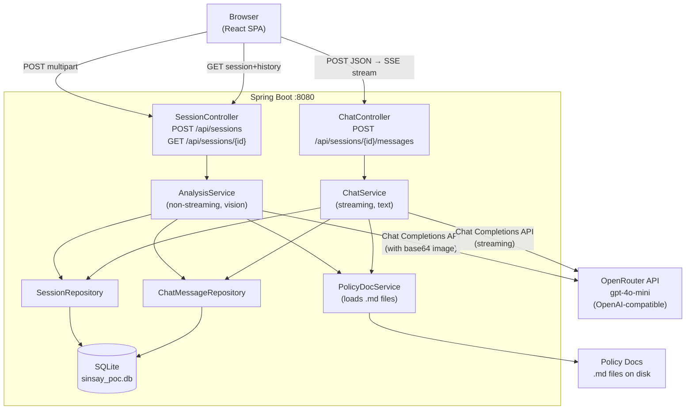
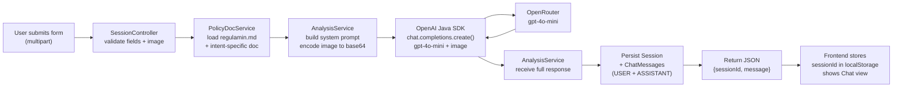
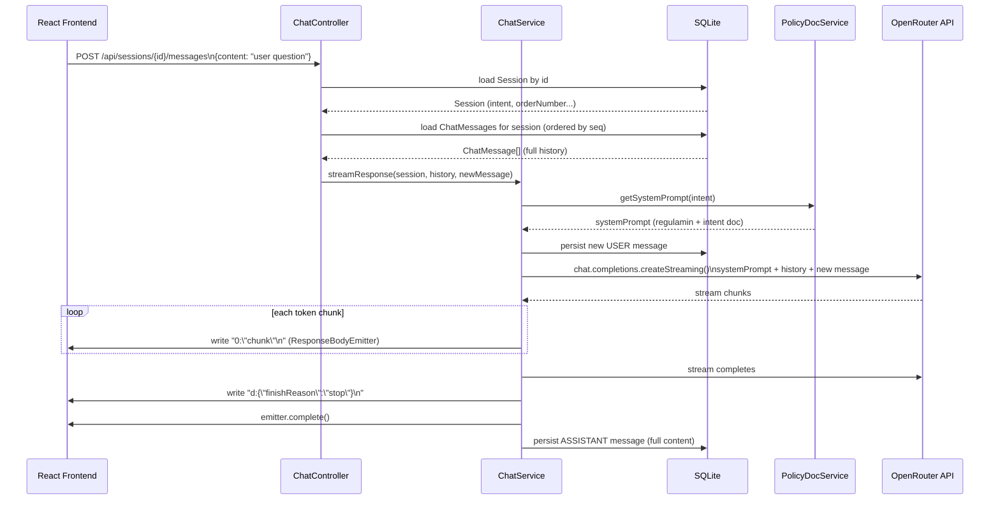
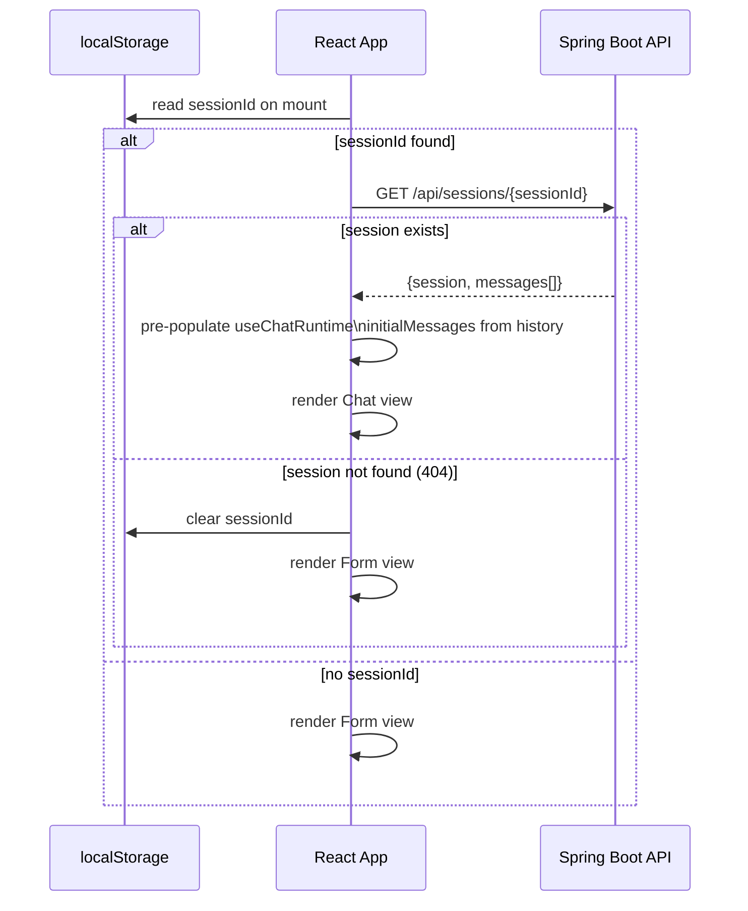

# ADR: Sinsay AI PoC — Main Architecture

**Date:** 2026-03-27
**Status:** Accepted
**PRD:** `docs/PRD-Product-Requirements-Document.md`

---

## 1. Overview

Single-artifact Spring Boot application serving a React SPA. The user submits a form with product data and one image. The backend analyzes the image via a multimodal LLM (OpenRouter → GPT-4o-mini) and streams the decision as a chat response. The user can then continue the conversation. Sessions are persisted in SQLite.

This is a PoC — simplicity over completeness. No auth, no external integrations, no admin UI.

---

## 2. Context7 Library References

| Library | Context7 library ID Handle | Used for |
|---|---|---|
| OpenAI Java SDK | `/openai/openai-java` | LLM API calls from backend (chat completions + vision) |
| Spring Boot | `/spring-projects/spring-boot` | Backend framework, DI, MVC, JPA |
| assistant-ui | `/assistant-ui/assistant-ui` | Chat UI components (React) |
| Vercel AI SDK | `/vercel/ai` | `useChat` hook wrapped by assistant-ui's `useChatRuntime` |
| React | `/reactjs/react.dev` | Frontend framework |
| Tailwind CSS | `/tailwindlabs/tailwindcss.com` | Utility styling |
| Shadcn/ui | `/shadcn-ui/ui` | UI component primitives |

---

## 3. System Architecture

### Architecture pattern
Monolith. Single deployable JAR. React SPA is built by Vite and bundled into `backend/src/main/resources/static/` at build time. Spring Boot serves it as static resources. No separate frontend server in production.

In development: Vite dev server runs on port 5173 and proxies `/api/*` to Spring Boot on port 8080.

### Repository structure

```
sinsay-poc/
├── .env                             # Local env vars (gitignored)
├── docs/
│   ├── PRD-Product-Requirements-Document.md
│   ├── ADR/
│   ├── regulamin.md                 # Terms of service (always loaded)
│   ├── reklamacje.md                # Complaint policy (COMPLAINT intent only)
│   └── zwrot-30-dni.md              # Return policy (RETURN intent only)
├── backend/
│   ├── pom.xml                      # Maven project
│   ├── src/main/java/com/sinsay/
│   │   ├── config/      # AppConfig, OpenAIConfig, WebConfig (CORS)
│   │   ├── controller/  # SessionController, ChatController
│   │   ├── service/     # AnalysisService, ChatService, PolicyDocService
│   │   ├── repository/  # SessionRepository, ChatMessageRepository
│   │   └── model/       # Session, ChatMessage (JPA entities)
│   └── src/main/resources/
│       ├── application.properties
│       └── static/      # Built React app lands here (Vite output)
└── frontend/
    ├── package.json
    ├── vite.config.ts   # output dir: ../backend/src/main/resources/static/
    └── src/
        ├── components/  # Form, ChatWindow, MessageBubble
        ├── hooks/       # useSession, useChat (wrapper)
        └── App.tsx      # Root — renders Form or Chat based on sessionId
```

### Technology stack

| Layer | Technology | Reason |
|---|---|---|
| Backend runtime | Java 21 | LTS, project requirement |
| Backend framework | Spring Boot 3.5.9 (WebMVC) | Project requirement; WebMVC sufficient for PoC |
| Build tool | Maven | Project requirement |
| Code generation | Lombok | Reduces boilerplate on entities/DTOs |
| LLM client | OpenAI Java SDK (official, `com.openai:openai-java`) | See ADR-001-backend |
| LLM provider | OpenRouter (OpenAI-compatible endpoint) | Multi-model access, cost control |
| LLM model | `openai/gpt-4o-mini` (configurable via env) | Supports vision, cheaper than gpt-4o, sufficient for PoC |
| Persistence | SQLite via Hibernate Community Dialects | See ADR-003 (in ADR-001-backend) |
| Frontend framework | React 19 | Project requirement |
| Frontend language | TypeScript (strict mode) | Project requirement |
| Frontend build | Vite | Fast DX, simple config |
| Chat UI | assistant-ui (`@assistant-ui/react`, `@assistant-ui/react-ai-sdk`) | See ADR-002-frontend |
| Streaming protocol | Vercel AI SDK data stream (via `useChat`) | Required by assistant-ui `useChatRuntime` |
| UI primitives | Shadcn/ui + Tailwind CSS | Component library compatible with assistant-ui |

---

## 4. Module Structure & Dependencies

```
SessionController
  └── depends on: AnalysisService, SessionRepository

ChatController
  └── depends on: ChatService, SessionRepository, ChatMessageRepository

AnalysisService
  └── depends on: OpenAIClient (bean), PolicyDocService
  └── performs: initial multimodal analysis (non-streaming), creates session

ChatService
  └── depends on: OpenAIClient (bean), PolicyDocService, ChatMessageRepository
  └── performs: streaming chat continuation (Vercel data stream format)

PolicyDocService
  └── depends on: filesystem (reads .md files from POLICY_DOCS_PATH)
  └── exposes: getSystemPrompt(intent) → String (regulamin + intent-specific doc)

SessionRepository (JPA)
  └── depends on: SQLite datasource

ChatMessageRepository (JPA)
  └── depends on: SQLite datasource
```

No circular dependencies. Service layer is unaware of HTTP concerns. Controllers handle HTTP and delegate to services.

---

## 5. Data Models

### Session
Represents one user interaction from form submission through the chat.

| Field | Type | Notes |
|---|---|---|
| id | UUID | Primary key, generated on creation |
| intent | Enum: RETURN / COMPLAINT | Determines which policy docs are loaded |
| orderNumber | String (max 100) | Stored as-is, not validated |
| productName | String (max 255) | |
| description | TEXT | User's problem description from form |
| createdAt | LocalDateTime | Set on creation |

### ChatMessage
One message in the conversation for a session.

| Field | Type | Notes |
|---|---|---|
| id | UUID | Primary key |
| sessionId | UUID | Foreign key → Session |
| role | Enum: USER / ASSISTANT | |
| content | TEXT | Full message content |
| sequenceNumber | Integer | Ordering within session (0-based) |
| createdAt | LocalDateTime | |

---

## 6. API Contracts

### POST `/api/sessions` — Initial form submission and analysis
- **Content-Type:** `multipart/form-data`
- **Request fields:** `intent` (String: "RETURN"|"COMPLAINT"), `orderNumber` (String), `productName` (String), `description` (String), `image` (file: JPEG/PNG/WebP/GIF, max 10 MB)
- **Response (200):** `application/json`
  ```
  {
    sessionId: string (UUID),
    message: string   (full AI analysis text, not streamed)
  }
  ```
- **Response (400):** validation error (missing fields, invalid image format or size)
- **Notes:** Image is base64-encoded by backend before sending to OpenAI. Session + initial AI message are persisted before response. This call is NOT streamed — frontend shows loading state.

### GET `/api/sessions/{sessionId}` — Load existing session
- **Response (200):** `application/json`
  ```
  {
    session: {
      id, intent, orderNumber, productName, description, createdAt
    },
    messages: [
      { id, role: "USER"|"ASSISTANT", content, sequenceNumber }
    ]
  }
  ```
- **Response (404):** session not found

### POST `/api/sessions/{sessionId}/messages` — Continue conversation (streaming)
- **Content-Type:** `application/json`
- **Request body:** `{ "content": "user message text" }`
- **Response (200):** `text/plain;charset=UTF-8` — Vercel data stream format, streamed
  - Each text chunk: `0:"<JSON-escaped text>"\n`
  - Finish signal: `d:{"finishReason":"stop"}\n`
- **Response (404):** session not found
- **Notes:** Backend loads full message history from DB + reconstructs system prompt + calls OpenAI. Persists new USER and ASSISTANT messages to DB during/after streaming.

---

## 7. Environment Variables

| Variable | Purpose | Required | Default / Example |
|---|---|---|---|
| `OPENAI_API_KEY` | OpenRouter API key | Yes | `sk-or-v1-...` |
| `OPENAI_BASE_URL` | API base URL | Yes | `https://openrouter.ai/api/v1` |
| `OPENAI_MODEL` | Model identifier on OpenRouter | No | `openai/gpt-4o-mini` |
| `POLICY_DOCS_PATH` | Path to directory containing .md policy files | No | `../docs` (relative to `backend/`) |

The OpenAI Java SDK automatically picks up `OPENAI_API_KEY` and `OPENAI_BASE_URL` from environment via `OpenAIOkHttpClient.fromEnv()`. `OPENAI_MODEL` and `POLICY_DOCS_PATH` are custom Spring Boot config properties.

---

## 8. Key Technical Decisions

### OpenAI Java SDK vs Spring AI
**Status:** Accepted
**Context:** The project needs to call an OpenAI-compatible LLM API from Java. Two main options exist: the official OpenAI Java SDK and Spring AI (Spring's abstraction layer).
**Decision:** Use the official OpenAI Java SDK. It maps directly to the OpenAI Chat Completions API, supports `baseUrl` override for OpenRouter out of the box, and has a stable streaming API. Spring AI introduces an abstraction layer that is unnecessary for a PoC and has less mature OpenRouter support.
**Rejected alternatives:**
- Spring AI: Adds abstraction overhead, additional config, and less direct control over the request format (important for multimodal image payloads).
**Consequences:**
- (+) Direct API control, predictable behavior, official SDK with good docs
- (+) OpenRouter works via simple `baseUrl` + `apiKey` override
- (-) Not Spring-idiomatic; manual bean configuration required
- (-) If project grows to multi-provider, Spring AI's abstraction would be more convenient
**Review trigger:** If we need to support multiple LLM providers with different APIs, or if Spring AI's OpenRouter support matures.

---

### Non-streaming initial analysis vs streaming everything
**Status:** Accepted
**Context:** The PRD requires the chat to stream token-by-token. The initial analysis (form submission) also sends an image which requires multipart encoding — combining multipart upload with SSE streaming response is non-trivial.
**Decision:** Initial form submission (`POST /api/sessions`) returns a plain JSON response with the full AI message (non-streaming). The frontend shows a loading spinner. Chat continuation (`POST /api/sessions/{id}/messages`) uses SSE streaming. This separates the complex multipart image handling from streaming.
**Rejected alternatives:**
- Full streaming from the start: Requires either base64-encoding the image in JSON (bypasses multipart) or chunked streaming over multipart — both complex for PoC.
**Consequences:**
- (+) Simpler backend, fewer integration edge cases
- (-) Initial analysis has a perceivable loading delay (no progressive output)
**Review trigger:** If UX testing shows the loading delay is unacceptable for initial analysis.

---

### Vercel data stream protocol for chat streaming
**Status:** Accepted
**Context:** assistant-ui's `useChatRuntime` wraps Vercel AI SDK's `useChat` hook, which expects a specific streaming wire format. The backend must emit this format.
**Decision:** The Spring Boot chat endpoint returns `text/plain;charset=UTF-8` with `Transfer-Encoding: chunked`. Each line is a Vercel data stream protocol token: `0:"<text>"\n`. The stream ends with `d:{"finishReason":"stop"}\n`. The frontend uses `useChatRuntime` with `streamProtocol: 'data'` (default).
**Rejected alternatives:**
- Raw SSE (`text/event-stream`): Would require custom adapter in the frontend to translate SSE events into the data stream format that `useChat` expects.
- useLocalRuntime (non-streaming): Loses the streaming UX required by the PRD.
**Consequences:**
- (+) Native integration with assistant-ui and useChat — no custom stream parsing on frontend
- (-) Backend must produce exactly the right format; incorrect escaping will break the client
**Review trigger:** If assistant-ui upgrades to a different default protocol (check on version upgrade).

---

### SQLite for session persistence
**Status:** Accepted
**Context:** The PoC needs to persist session data and chat history. PostgreSQL/MySQL would require a running database server. Redis would require a separate service.
**Decision:** SQLite via JPA (Hibernate Community Dialects for SQLite). Single file (`sinsay_poc.db`) in the `backend/` directory. Zero setup, works out of the box.
**Rejected alternatives:**
- H2 in-file mode: Compatible but less standard, not usable by external tools.
- PostgreSQL: Production-grade but requires Docker/server setup — overkill for PoC.
**Consequences:**
- (+) Zero infrastructure overhead, file-based, easy to inspect
- (-) No concurrent write support (single writer) — not a concern for PoC
- (-) Must be swapped out before any multi-instance production deployment
**Review trigger:** If concurrent sessions exceed ~10 simultaneous users or if we add horizontal scaling.

---

## 9. Diagrams

### 9.1 Component Diagram



### 9.2 Data Flow — Initial Form Submission



### 9.3 Sequence Diagram — Chat Continuation (Streaming)



### 9.4 Sequence Diagram — Session Resume



---

## 10. Testing Strategy

See `docs/ADR/001-backend.md` §8 and `docs/ADR/002-frontend.md` §7 for layer-specific test plans.

### Overall philosophy
TDD: implementing agents should write tests before or alongside implementation. Tests are the primary mechanism for self-validating that the implementation matches this ADR and the PRD.

### Test layers

| Layer | Type | Tools |
|---|---|---|
| Backend unit | Service logic, policy doc loading, format encoding | JUnit 5, Mockito |
| Backend integration | HTTP endpoints, DB persistence, stream format | Spring Boot Test, MockMvc, H2 in-test |
| Frontend unit | Form validation, session logic, component rendering | Vitest, React Testing Library |
| Frontend integration | Chat flow, session resume | Vitest + MSW (mock service worker) |

### Technical Acceptance Criteria

- TAC-01: `POST /api/sessions` with valid multipart (all fields + valid image) returns HTTP 200 with `sessionId` (UUID) and non-empty `message`
- TAC-02: `POST /api/sessions` with intent=RETURN — system prompt sent to OpenAI contains content of `regulamin.md` and `zwrot-30-dni.md`, does NOT contain `reklamacje.md`
- TAC-03: `POST /api/sessions` with intent=COMPLAINT — system prompt contains `regulamin.md` and `reklamacje.md`, does NOT contain `zwrot-30-dni.md`
- TAC-04: `POST /api/sessions` with image > 10 MB returns HTTP 400
- TAC-05: `POST /api/sessions` with image in unsupported format (e.g., PDF) returns HTTP 400
- TAC-06: `POST /api/sessions` with any required field missing returns HTTP 400
- TAC-07: `GET /api/sessions/{id}` with valid ID returns correct session + messages in sequenceNumber order
- TAC-08: `GET /api/sessions/{unknown}` returns HTTP 404
- TAC-09: `POST /api/sessions/{id}/messages` returns `Content-Type: text/plain` response, body contains at least one line matching `^0:".*"\n`
- TAC-10: `POST /api/sessions/{id}/messages` body ends with `d:{"finishReason":"stop"}\n`
- TAC-11: After `POST /api/sessions/{id}/messages` completes, both USER and ASSISTANT messages are persisted in DB
- TAC-12: Data in SQLite survives JVM restart (file-based persistence verified)
- TAC-13: Frontend stores sessionId in localStorage after successful form submission
- TAC-14: Frontend loads and displays session history when sessionId exists in localStorage on page load
- TAC-15: Frontend clears localStorage and shows empty form when "Nowa sesja" is clicked
