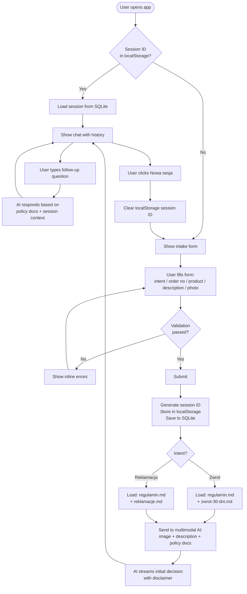

# PRD — Sinsay AI Return & Complaint Assistant (PoC)

---

## 1. Executive Summary

A single-page web application that allows Sinsay customers to submit a product return or complaint request by filling out a short form and uploading a photo. A multimodal AI model analyzes the image and the customer's description against Sinsay's return/complaint policies and provides a preliminary decision with explanation. The customer can then continue the conversation in a chat window to ask follow-up questions. This is a PoC — no submission to external systems, no authentication.

---

## 2. Problem Statement

Customers do not know in advance whether their return or complaint will be accepted. They waste time contacting customer support for cases that could be pre-screened automatically. The goal is to give customers an instant, policy-based preliminary assessment before they involve a human agent, reducing unnecessary support contacts and setting correct expectations.

---

## 3. Users / Personas

**Persona 1 — Standard returner**
Customer who bought clothing, tried it on, and wants to return it within 30 days. Product is unused, tags still on. Wants to know if their return is valid before sending.

**Persona 2 — Complaint submitter**
Customer who received a product with a manufacturing defect (e.g., broken zipper, torn seam). Within the 2-year complaint window. Wants to know if the damage qualifies for a complaint.

**Persona 3 — Uncertain case**
Customer unsure whether to file a return or a complaint. Product has some damage — unclear if it's from use or a defect. Needs guidance on which path to take and whether it will be accepted.

---

## 4. Main Flows

### Flow A — Return (Zwrot)

1. Customer opens the application. Sees the intake form.
2. Customer selects "Zwrot" (return) as the intent.
3. Customer enters order number, product name, and description of why they want to return it.
4. Customer uploads one photo of the product.
5. Customer submits the form.
6. Application sends the form data and image to the AI model. Context includes: `docs/regulamin.md` + `docs/zwrot-30-dni.md`.
7. AI analyzes: product condition (signs of use, tags present/absent), described reason, policy eligibility.
8. AI response is shown in the chat window: preliminary decision (accepted / rejected / unclear), explanation of the reasoning, and reference to the relevant policy rules.
9. Customer reads the decision and can ask follow-up questions in the chat.
10. Agent answers based on policy docs and redirects off-topic questions back to the return/complaint process.

### Flow B — Complaint (Reklamacja)

Steps 1–5 same as Flow A, with "Reklamacja" selected as intent.

6. Application sends the form data and image to the AI model. Context includes: `docs/regulamin.md` + `docs/reklamacje.md`.
7. AI analyzes: type of damage visible in the photo, whether it looks like a manufacturing defect vs. damage from use, policy eligibility (2-year window stated in description).
8–10. Same as Flow A.

### Flow C — Returning user (session resume)

1. Customer opens the application on the same device.
2. Application detects a session ID in localStorage.
3. Application loads the previous session from SQLite and restores the full chat history.
4. Customer can continue the conversation or review the previous decision.

---

## 5. User Stories

**US-01** — As a customer, I want to select whether I'm making a return or a complaint, so that the AI uses the correct policy when evaluating my case.

**US-02** — As a customer, I want to upload a photo of my product and describe the problem, so that the AI can assess my case based on the actual product condition.

**US-03** — As a customer, I want to receive a clear preliminary decision with an explanation, so that I know whether my return or complaint is likely to be accepted before contacting support.

**US-04** — As a customer, I want to ask follow-up questions after the decision, so that I can understand the reasoning and learn what steps to take next (e.g., how to ship the product).

**US-05** — As a customer, I want to see the decision even if the case is ambiguous, so that I know I need to contact customer support for a manual review.

**US-06** — As a customer, I want to return to my previous session on the same device, so that I don't have to resubmit the form and can continue a previous conversation.

**US-07** — As a customer with an invalid image, I want to see a clear error message that tells me what formats and size are accepted, so that I can correct the file and resubmit without confusion.

---

## 6. Acceptance Criteria

### Form

- AC-01: Form has exactly 5 fields: intent (radio: Zwrot / Reklamacja), order number (text), product name (text), problem description (textarea), photo (file upload).
- AC-02: All 5 fields are required. Submission is blocked if any field is empty.
- AC-03: Photo field accepts only JPEG, PNG, WebP, and GIF formats. Any other format is rejected with an error message before submission.
- AC-04: Photo file size is limited to 10 MB. Files exceeding this limit are rejected with an error message before submission.
- AC-05: Error messages are shown inline next to the relevant field. Form does not scroll to top on validation error.
- AC-06: Submit button shows a loading state while the AI is processing. User cannot submit twice.

### AI Decision

- AC-07: After submission, the chat window opens and the first message from the AI contains: (a) a clear preliminary verdict (return/complaint likely accepted / likely rejected / unclear — requires manual review), (b) reasoning grounded in the relevant policy, (c) a disclaimer that this is not a legally binding decision and the final decision is always made by a Sinsay customer support agent.
- AC-08: If intent is "Zwrot", the AI receives only `docs/regulamin.md` and `docs/zwrot-30-dni.md` as policy context. `docs/reklamacje.md` is not included.
- AC-09: If intent is "Reklamacja", the AI receives only `docs/regulamin.md` and `docs/reklamacje.md` as policy context. `docs/zwrot-30-dni.md` is not included.
- AC-10: All AI responses are in Polish.
- AC-11: If the AI cannot make a clear determination from the image and description, the response explicitly states the case is unclear and recommends contacting Sinsay customer support directly.

### Chat

- AC-12: After the initial AI decision is shown, the customer can type follow-up messages. The agent responds in Polish.
- AC-13: If the customer asks questions unrelated to returns, complaints, or Sinsay policy, the agent provides a brief answer (if possible from the policy documents) and redirects the conversation back to the return/complaint topic.
- AC-14: The agent does not make up information not present in the provided policy documents.

### Session

- AC-15: A unique session ID is generated on first form submission and stored in the browser's localStorage.
- AC-16: The full session (form data + chat history) is persisted in SQLite keyed by session ID.
- AC-17: On page load, if a session ID is found in localStorage, the application loads and displays that session's chat history instead of the empty form.
- AC-18: There is a visible "Nowa sesja" (New session) button that clears the localStorage session ID and shows the empty form again.

### General

- AC-19: The application is in Polish (all labels, placeholders, buttons, error messages).
- AC-20: The application works on mobile browsers (responsive layout, form and chat usable on screens 375px wide and up).

---

## 7. Out of Scope (PoC)

- **No authentication or user accounts.** Sessions are anonymous, identified by localStorage session ID only.
- **No submission of return/complaint requests to any Sinsay system.** The tool provides assessment only.
- **No order number verification.** Order number is stored but not validated against any database or Sinsay API.
- **No multiple photos.** Only one image per session.
- **No admin panel or dashboard.** SQLite data is not exposed via any UI for Sinsay staff.
- **No email notifications.** No communication is sent to the customer or Sinsay after the session.
- **No multilingual support.** Polish only.
- **No integration with Sinsay customer panel or order history.** Simple PoC functionality.

---

## 8. Constraints

### Business

- The AI decision is always preliminary and non-binding. This must be communicated clearly to the user in every initial response.
- Policy documents (`docs/regulamin.md`, `docs/reklamacje.md`, `docs/zwrot-30-dni.md`) are the sole source of truth for the AI's assessments. The AI must not invent rules beyond these documents.
- Documents are in Polish and hardcoded for this PoC. They are loaded from the filesystem and injected into the AI system prompt at request time.

### Functional

- Image formats accepted: JPEG, PNG, WebP, GIF (as supported by the vision API used).
- Maximum image size: 10 MB (within the 20 MB hard limit of the vision API).
- Only 1 image per session.
- Session history is stored in a local SQLite database file.
- The application is a single-page app — no multi-page navigation.

### Policy document references (for developer agent)

These files must be loaded by the backend and injected into the AI system prompt:

| Document | Path | Used for intent |
|---|---|---|
| Regulamin sklepu | `docs/regulamin.md` | Both (always included) |
| Jak złożyć reklamację | `docs/reklamacje.md` | Reklamacja only |
| 30 dni na zwrot | `docs/zwrot-30-dni.md` | Zwrot only |

---

## 9. UI Description (wireframe level)

### Screen 1 — Intake Form

Full-page centered form. Sinsay logo at the top. Below it, a short heading: "Sprawdź zwrot lub reklamację" and a one-sentence description of what the tool does.

The form contains:
1. **Intent selector** — two large radio buttons or toggle buttons side by side: "Zwrot" and "Reklamacja". One must be selected before the rest of the form is enabled (or the form may be visible but submission blocked).
2. **Numer zamówienia** — text input, placeholder: e.g. "PL123456789".
3. **Nazwa produktu** — text input, placeholder: e.g. "Sukienka midi w kwiaty".
4. **Opis problemu** — textarea, min 3 visible rows, placeholder guiding the user to describe the product condition and the reason for return/complaint.
5. **Zdjęcie produktu** — file upload area. Drag-and-drop zone with a click-to-browse fallback. Shows accepted formats and size limit. After file selection, shows a thumbnail preview and filename. Allows replacing the selected file.

Below the fields: a primary "Sprawdź" submit button (full width or centered, prominent). While processing, the button shows a spinner and "Analizuję..." text and is disabled.

Validation errors appear inline below each field in red text. The form does not reset on error.

### Screen 2 — Chat (post-submission)

The form disappears. The chat window fills the screen.

At the top: a small summary bar showing the intent (Zwrot/Reklamacja), product name, and order number — collapsed, not interactive.

Below: a scrollable chat thread. The first message is from the AI assistant and contains the initial decision. Messages are visually differentiated: user messages on the right (or distinct background), AI messages on the left.

At the bottom: a fixed text input with a send button. Pressing Enter submits the message.

In the top-right corner (or accessible via a menu): a "Nowa sesja" button that resets the application to the empty form.

The chat does not show a loading spinner between messages — the AI response streams in token by token (streaming output).

---

## 10. User Flow Diagram

---

## 11. AI Agent Behavior Specification

### System prompt must instruct the agent to:

1. **Role**: You are an AI assistant for Sinsay online store. Your purpose is to help customers estimate whether their return (zwrot) or complaint (reklamacja) is likely to be accepted based on Sinsay's policies and the product photo provided.

2. **Decision categories**:
   - **Likely accepted** — image and description clearly meet policy requirements.
   - **Likely rejected** — image or description clearly violates policy requirements (e.g., product shows signs of heavy use for a return, or damage appears to be from user misuse rather than a defect for a complaint).
   - **Unclear — requires manual review** — image quality is insufficient, the case is borderline, or the damage type is ambiguous.

3. **Mandatory disclaimer** in every initial decision response: clearly state that this assessment is not legally binding, is an estimate only, and that the final binding decision is always made by a Sinsay customer support agent.

4. **Scope**: Answer questions about Sinsay policies, return/complaint procedures, deadlines, shipping instructions, and related topics — based only on the provided policy documents. If asked something outside this scope, provide a brief general response if possible, then redirect: "Czy mogę pomóc Ci w czymś związanym z Twoim zwrotem lub reklamacją?"

5. **Language**: Always respond in Polish.

6. **No hallucination**: Do not invent rules, deadlines, addresses, or procedures not present in the provided documents.
